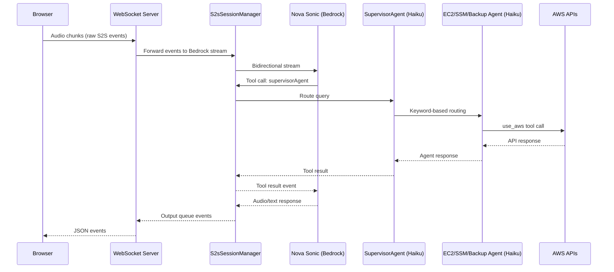
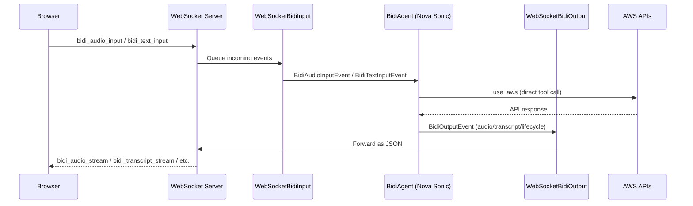
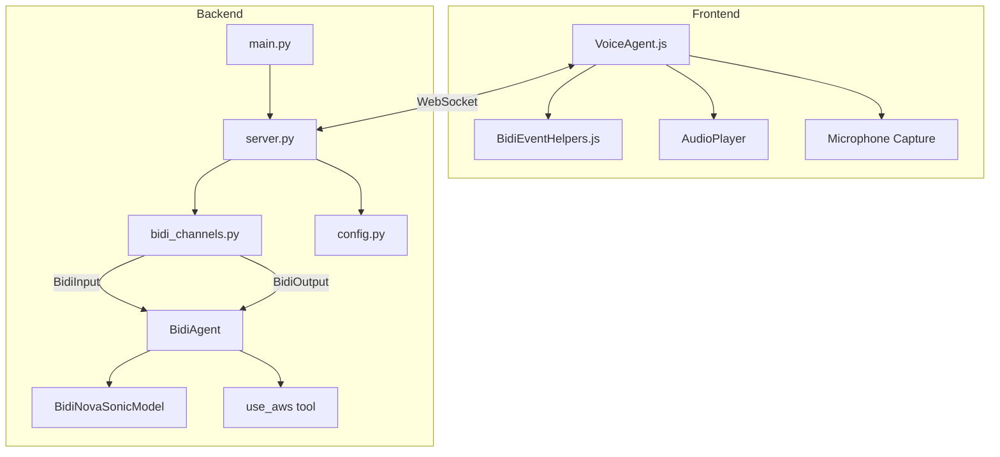

# Design Document: BidiAgent Refactor

## Overview

This design describes the refactoring of the voice-based AWS assistant from a multi-hop architecture (Nova Sonic → SupervisorAgent → specialized Claude Haiku agents) to a single-hop architecture using Strands Agents' `BidiAgent`. The current system routes voice queries through three LLM hops: Nova Sonic transcribes speech and invokes a `supervisorAgent` tool, which calls a Claude Haiku SupervisorAgent that keyword-routes to one of three specialized Claude Haiku agents (EC2Agent, SSMAgent, BackupAgent), each of which calls `use_aws`. The refactored system uses a single `BidiAgent` with `BidiNovaSonicModel` that natively handles speech-to-text, reasoning, tool execution via `use_aws`, and text-to-speech in one bidirectional stream.

The refactor touches three layers:
1. **Backend**: Replace `S2sSessionManager` + multi-agent orchestration with `BidiAgent`, implement custom `BidiInput`/`BidiOutput` channels bridging the frontend WebSocket.
2. **Frontend**: Replace the Nova Sonic raw event protocol (`sessionStart`, `promptStart`, `audioInput`, etc.) with the BidiAgent event protocol (`bidi_audio_input`, `bidi_text_input`, `bidi_audio_stream`, `bidi_transcript_stream`, etc.).
3. **Cleanup**: Remove all obsolete multi-agent files, update dependencies.

## Architecture

### Current Architecture (Multi-Hop)



### Target Architecture (Single-Hop)



### Component Diagram



## Components and Interfaces

### 1. Backend: `config.py` (Modified)

Update `AgentConfig` to support BidiAgent configuration and add a factory for `BidiNovaSonicModel`.

```python
@dataclass
class AgentConfig:
    region: str = "us-east-1"
    profile_name: str = None
    voice_id: str = "matthew"
    input_sample_rate: int = 16000
    output_sample_rate: int = 24000
    audio_channels: int = 1
    audio_format: str = "pcm"

def create_bidi_model(config: AgentConfig) -> BidiNovaSonicModel:
    """Create a BidiNovaSonicModel configured with the given AgentConfig."""
    session = boto3.Session(
        profile_name=config.profile_name,
        region_name=config.region
    )
    return BidiNovaSonicModel(
        model_id="amazon.nova-sonic-v1:0",
        provider_config={
            "audio": {
                "input_rate": config.input_sample_rate,
                "output_rate": config.output_sample_rate,
                "voice": config.voice_id,
                "channels": config.audio_channels,
                "format": config.audio_format,
            }
        },
        client_config={
            "boto_session": session,
            "region": config.region,
        }
    )
```

Remove `VoiceConfig`, `create_bedrock_model`, and the Claude Haiku `model_id` default. Remove the `BedrockModel` import.

### 2. Backend: `bidi_channels.py` (New)

Two classes implementing the BidiAgent I/O protocol, bridging the frontend WebSocket.

#### `WebSocketBidiInput`

```python
class WebSocketBidiInput(BidiInput):
    """Reads events from the frontend WebSocket and yields BidiInputEvents to BidiAgent."""

    def __init__(self, websocket):
        self._websocket = websocket
        self._queue: asyncio.Queue = asyncio.Queue()
        self._running = False
        self._reader_task = None

    async def start(self, agent: BidiAgent) -> None:
        """Start reading from the WebSocket into an internal queue."""
        self._running = True
        self._reader_task = asyncio.create_task(self._read_loop())

    async def __call__(self) -> BidiInputEvent:
        """Return the next input event for BidiAgent. Blocks until available."""
        return await self._queue.get()

    async def stop(self) -> None:
        """Stop reading and clean up."""
        self._running = False
        if self._reader_task:
            self._reader_task.cancel()
```

The `_read_loop` reads JSON messages from the WebSocket, dispatches:
- `{"type": "bidi_audio_input", "data": "<base64>"}` → `BidiAudioInputEvent`
- `{"type": "bidi_text_input", "text": "..."}` → `BidiTextInputEvent`
- `{"type": "close"}` → signals stop (puts a sentinel/raises StopIteration)

On WebSocket disconnect (`ConnectionClosed`), the loop ends and signals the agent to stop.

#### `WebSocketBidiOutput`

```python
class WebSocketBidiOutput(BidiOutput):
    """Receives BidiOutputEvents from BidiAgent and forwards them over the WebSocket."""

    def __init__(self, websocket):
        self._websocket = websocket

    async def start(self, agent: BidiAgent) -> None:
        """No-op; WebSocket is already connected."""
        pass

    async def __call__(self, event: BidiOutputEvent) -> None:
        """Serialize the event and send it over the WebSocket."""
        message = self._serialize_event(event)
        if message:
            await self._websocket.send(json.dumps(message))

    async def stop(self) -> None:
        """No-op; WebSocket lifecycle managed by server."""
        pass
```

The `_serialize_event` method maps each `BidiOutputEvent` type to a JSON structure:

| BidiOutputEvent type | JSON `type` field | Key payload fields |
|---|---|---|
| `BidiAudioStreamEvent` | `bidi_audio_stream` | `data` (base64), `format`, `sample_rate`, `channels` |
| `BidiTranscriptStreamEvent` | `bidi_transcript_stream` | `role`, `text`, `is_final`, `delta` |
| `BidiConnectionStartEvent` | `bidi_connection_start` | `connection_id`, `model` |
| `BidiConnectionCloseEvent` | `bidi_connection_close` | `connection_id`, `reason` |
| `BidiConnectionRestartEvent` | `bidi_connection_restart` | (empty payload) |
| `BidiInterruptionEvent` | `bidi_interruption` | `reason` |
| `BidiResponseStartEvent` | `bidi_response_start` | `response_id` |
| `BidiResponseCompleteEvent` | `bidi_response_complete` | `response_id`, `stop_reason` |
| `BidiErrorEvent` | `bidi_error` | `message`, `code`, `details` |

### 3. Backend: `server.py` (Rewritten)

The WebSocket server is simplified. Per-connection handler:

1. Parse optional `config` message from frontend (voice_id).
2. Create `AgentConfig` with voice_id (or default "matthew"), profile, region.
3. Create `BidiNovaSonicModel` via `create_bidi_model(config)`.
4. Build system prompt (consolidated from all agent prompts + consent protocol).
5. Create `BidiAgent(model=model, tools=[use_aws], system_prompt=system_prompt)`.
6. Create `WebSocketBidiInput(websocket)` and `WebSocketBidiOutput(websocket)`.
7. Call `await agent.run(inputs=[bidi_input], outputs=[bidi_output])`.
8. On completion or error, ensure cleanup.

```python
async def websocket_handler(websocket, path, profile_name, region):
    config = AgentConfig(profile_name=profile_name, region=region)

    # Wait for optional config message
    try:
        first_msg = await asyncio.wait_for(websocket.recv(), timeout=5.0)
        data = json.loads(first_msg)
        if data.get("type") == "config":
            config.voice_id = data.get("voice_id", "matthew")
    except (asyncio.TimeoutError, json.JSONDecodeError):
        pass  # Use defaults

    os.environ["BYPASS_TOOL_CONSENT"] = "true"

    model = create_bidi_model(config)
    system_prompt = build_system_prompt()

    agent = BidiAgent(model=model, tools=[use_aws], system_prompt=system_prompt)
    bidi_input = WebSocketBidiInput(websocket)
    bidi_output = WebSocketBidiOutput(websocket)

    try:
        await agent.run(inputs=[bidi_input], outputs=[bidi_output])
    except Exception as e:
        # Send error event to frontend
        error_msg = {"type": "bidi_error", "message": str(e)}
        await websocket.send(json.dumps(error_msg))
    finally:
        await bidi_input.stop()
        await bidi_output.stop()
```

The `build_system_prompt()` function consolidates:
- AWS service instructions (EC2, SSM, Backup) from the existing specialized agent prompts
- The dangerous operation consent protocol from `prompt_consent.py`'s `get_consent_instructions()`
- Voice-appropriate response guidelines (concise, no markdown)
- Non-AWS query rejection instructions

### 4. Backend: `main.py` (Simplified)

Remove orchestrator initialization. The entry point just parses CLI args and calls `run_server()`. The `--voice` arg is kept but only used as a fallback default; the frontend's voice selection takes precedence.

### 5. Frontend: `BidiEventHelpers.js` (New, replaces `s2sEvents.js`)

A helper module for creating and parsing BidiAgent-compatible events:

```javascript
export const BidiEventHelpers = {
    audioInput(base64Data) {
        return { type: "bidi_audio_input", data: base64Data };
    },
    textInput(text) {
        return { type: "bidi_text_input", text };
    },
    config(voiceId) {
        return { type: "config", voice_id: voiceId };
    },
    close() {
        return { type: "close" };
    }
};
```

### 6. Frontend: `VoiceAgent.js` (Modified)

Key changes:
- **`connectWebSocket()`**: On open, send a `config` message with the selected voice_id. No more `sessionStart`, `promptStart`, `contentStartText`, `textInput`, `contentEnd`, `contentStartAudio` event sequence. Just send config and start streaming audio.
- **`startMicrophone()`**: Audio chunks sent as `bidi_audio_input` events instead of raw `audioInput` events with `promptName`/`contentName`.
- **`handleIncomingMessage()`**: Switch on `message.type` instead of `message.event[eventType]`. Handle `bidi_audio_stream`, `bidi_transcript_stream`, `bidi_interruption`, `bidi_connection_start`, `bidi_connection_close`, `bidi_connection_restart`, `bidi_response_start`, `bidi_response_complete`, `bidi_error`.
- **`endSession()`**: Send `close` event instead of `sessionEnd`.
- **Remove**: `promptName`, `textContentName`, `audioContentName` state. Remove `supervisorAgent` tool configuration from session setup.
- **Transcript handling**: `bidi_transcript_stream` events carry `role` ("user"/"assistant"), `text`, `is_final`, and `delta`. Build chat messages from these instead of `contentStart`/`textOutput`/`contentEnd` sequences.
- **Error handling**: On `bidi_error`, display alert banner with "Restart Conversation" button.

## Data Models

### Backend Event Flow

```
Frontend → WebSocket → WebSocketBidiInput._queue → BidiAgent
                                                        ↓
Frontend ← WebSocket ← WebSocketBidiOutput.__call__ ← BidiOutputEvent
```

### Frontend → Backend Messages

| Message Type | Fields | Description |
|---|---|---|
| `config` | `voice_id: string` | Initial configuration, sent once on connect |
| `bidi_audio_input` | `data: string (base64 PCM)` | Audio chunk from microphone |
| `bidi_text_input` | `text: string` | Text message input |
| `close` | (none) | End session signal |

### Backend → Frontend Messages

| Message Type | Fields | Description |
|---|---|---|
| `bidi_audio_stream` | `data`, `format`, `sample_rate`, `channels` | Audio output for playback |
| `bidi_transcript_stream` | `role`, `text`, `is_final`, `delta`, `current_transcript` | Speech transcript |
| `bidi_connection_start` | `connection_id`, `model` | Session established |
| `bidi_connection_close` | `connection_id`, `reason` | Session ended |
| `bidi_connection_restart` | (varies) | Timeout reconnection |
| `bidi_interruption` | `reason` | User barge-in detected |
| `bidi_response_start` | `response_id` | Agent started responding |
| `bidi_response_complete` | `response_id`, `stop_reason` | Agent finished responding |
| `bidi_error` | `message`, `code`, `details` | Error occurred |

### System Prompt Structure

The consolidated system prompt is a single string composed of:

1. **Role definition**: "You are a specialized AWS voice assistant..."
2. **AWS service instructions**: Merged from EC2Agent, SSMAgent, BackupAgent prompts
3. **Consent protocol**: Verbatim from `get_consent_instructions()` — lists dangerous operations per service, consent flow, safe operations
4. **Voice output guidelines**: Keep responses concise, no markdown formatting, suitable for speech
5. **Scope restriction**: Only handle AWS queries, redirect non-AWS topics


## Correctness Properties

*A property is a characteristic or behavior that should hold true across all valid executions of a system — essentially, a formal statement about what the system should do. Properties serve as the bridge between human-readable specifications and machine-verifiable correctness guarantees.*

### Property 1: Model configuration preserves all AgentConfig parameters

*For any* valid `AgentConfig` with an arbitrary profile name, region, voice ID, sample rates, channels, and audio format, calling `create_bidi_model(config)` shall produce a `BidiNovaSonicModel` whose `provider_config` audio section matches the config's voice ID, input/output sample rates, channels, and format, and whose `client_config` contains a boto3 Session with the specified profile and region.

**Validates: Requirements 1.2, 5.1, 6.3**

### Property 2: Input channel correctly transforms all frontend message types

*For any* JSON message received from the frontend WebSocket, if the message type is `bidi_audio_input` with base64 data, the `WebSocketBidiInput` channel shall produce a `BidiAudioInputEvent` containing that audio data; if the message type is `bidi_text_input` with text content, the channel shall produce a `BidiTextInputEvent` containing that text.

**Validates: Requirements 2.1, 2.3**

### Property 3: Output channel serializes all BidiOutputEvent types to valid JSON

*For any* `BidiOutputEvent` (including `BidiAudioStreamEvent`, `BidiTranscriptStreamEvent`, `BidiConnectionStartEvent`, `BidiConnectionCloseEvent`, `BidiInterruptionEvent`, `BidiResponseStartEvent`, `BidiResponseCompleteEvent`, `BidiErrorEvent`), the `WebSocketBidiOutput` channel shall produce a JSON-serializable dictionary with a `type` field matching the event type name and all relevant payload fields preserved.

**Validates: Requirements 2.2, 2.4, 2.5, 2.6**

### Property 4: Transcript events are displayed with the correct role

*For any* `bidi_transcript_stream` message received by the frontend with a `role` of "user" or "assistant" and a `text` value, the chat messages state shall contain an entry with that role and text content.

**Validates: Requirements 4.3**

### Property 5: Errors are forwarded as bidi_error events

*For any* exception raised during BidiAgent execution (tool errors, connection failures, unexpected errors), the `WebSocketBidiOutput` channel or the server handler shall send a JSON message with `type` equal to `bidi_error` and a `message` field containing a non-empty descriptive string.

**Validates: Requirements 9.1**

## Error Handling

### Backend Error Scenarios

| Error | Source | Handling |
|---|---|---|
| BidiNovaSonicModel connection failure | `agent.run()` raises exception | Server catches exception, sends `bidi_error` event to frontend, closes WebSocket cleanly |
| Tool execution error (use_aws) | BidiAgent internal | BidiAgent emits `BidiErrorEvent`, output channel forwards as `bidi_error` to frontend |
| WebSocket disconnect during session | `websockets.ConnectionClosed` | `WebSocketBidiInput._read_loop` catches exception, signals agent stop. Server `finally` block calls `bidi_input.stop()` and `bidi_output.stop()` |
| Invalid JSON from frontend | `json.loads()` raises `JSONDecodeError` | Input channel logs warning, skips the message, continues reading |
| AWS credentials invalid/expired | boto3 Session creation or API call | Surfaces as connection failure or tool error, handled by the above paths |

### Frontend Error Scenarios

| Error | Source | Handling |
|---|---|---|
| `bidi_error` event received | WebSocket message | Display error in alert banner with "Restart Conversation" button |
| WebSocket `onerror` | Network/server issue | Display error alert, end session, reset state |
| WebSocket `onclose` (abnormal) | Server crash, network drop | Display warning/error based on close code, end session |
| Microphone access denied | `getUserMedia` rejection | Display error message, prevent session start |

### Cleanup Guarantees

The server's `websocket_handler` uses a `try/finally` block to ensure:
1. `bidi_input.stop()` is called (cancels the reader task)
2. `bidi_output.stop()` is called
3. The BidiAgent session terminates when `agent.run()` returns or raises

The `WebSocketBidiInput` uses a cancellable `asyncio.Task` for the read loop, ensuring it doesn't leak on disconnect.

## Testing Strategy

### Property-Based Testing

Use `hypothesis` as the property-based testing library for Python backend tests. Each property test runs a minimum of 100 iterations.

Each property-based test must be tagged with a comment referencing the design property:
```python
# Feature: bidi-agent-refactor, Property 1: Model configuration preserves all AgentConfig parameters
```

**Property tests to implement:**

1. **Property 1 test**: Generate random `AgentConfig` instances (varying profile, region, voice_id, sample rates). Call `create_bidi_model()` and verify the returned model's config matches.
2. **Property 2 test**: Generate random audio (base64 strings) and text messages. Feed them through `WebSocketBidiInput` and verify the correct `BidiInputEvent` subtype is returned with the right data.
3. **Property 3 test**: Generate random `BidiOutputEvent` instances of each type with random payloads. Pass them through `WebSocketBidiOutput._serialize_event()` and verify the JSON output has the correct `type` field and all payload fields.
4. **Property 4 test** (frontend, using `fast-check`): Generate random transcript events with random roles and text. Verify the chat message handler produces entries with matching role and text.
5. **Property 5 test**: Generate random exceptions with random messages. Verify the error handling path produces a `bidi_error` JSON message with a non-empty `message` field.

### Unit Tests

Unit tests cover specific examples, edge cases, and integration points:

- **Config defaults**: Verify `AgentConfig()` defaults to `region="us-east-1"`, `voice_id="matthew"`, correct sample rates.
- **Voice ID default on missing config**: When no `config` message is received from frontend, verify voice defaults to "matthew" (edge case from 6.4).
- **System prompt content**: Verify `build_system_prompt()` contains EC2/SSM/Backup instructions, consent protocol, voice guidelines, and non-AWS rejection (examples from 3.1–3.4).
- **WebSocket disconnect signals stop**: Simulate `ConnectionClosed` in `WebSocketBidiInput._read_loop`, verify the agent receives a stop signal (example from 2.7).
- **Connection failure error event**: Simulate `BidiNovaSonicModel` connection failure, verify `bidi_error` is sent and WebSocket is closed (example from 9.2).
- **Cleanup on disconnect**: Simulate frontend disconnect, verify `bidi_input.stop()` and `bidi_output.stop()` are called (example from 9.3).
- **Frontend error display**: Verify `bidi_error` event triggers alert banner with restart option (example from 9.4).
- **Frontend interruption handling**: Verify `bidi_interruption` event calls `audioPlayer.bargeIn()` (example from 4.4).
- **Frontend close event handling**: Verify `bidi_connection_close` event displays disconnection message and resets state (example from 4.5).
- **Frontend end session**: Verify ending session sends `close` event and stops microphone (example from 4.6).

### Frontend Testing

Use `jest` with `fast-check` for property-based tests on the frontend. Unit tests use `jest` with React Testing Library.

### Test Configuration

- Python property tests: `hypothesis` with `@settings(max_examples=100)`
- JavaScript property tests: `fast-check` with `fc.assert(fc.property(...), { numRuns: 100 })`
- Each property test references its design property via comment tag
- Tag format: `Feature: bidi-agent-refactor, Property {number}: {property_text}`
