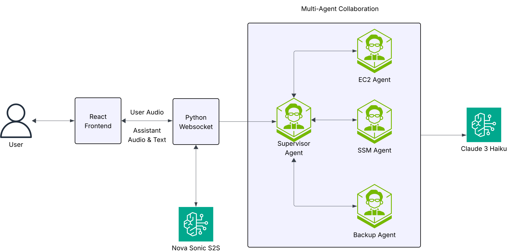

# AWS Strands Nova Voice Assistant

A sophisticated voice-based AI assistant using AWS Strands for multi-agent collaboration to interact with AWS services. The system features real-time voice interaction through Amazon Nova Sonic and intelligent routing between specialized AWS agents.

## 🚀 Features

- **Voice Interface**: Real-time voice input/output using Amazon Nova Sonic
- **Multi-Agent Architecture**: Supervisor agent coordinates between specialized agents
- **AWS Service Integration**: Comprehensive support for EC2, SSM, and AWS Backup operations
- **Intelligent Routing**: Automatic query routing to appropriate specialized agents
- **Professional UI**: AWS Cloudscape Design components with chat bubbles and event display

## Authors and acknowledgment
We would like to thank the following contributors for their valuable input and work on this project _(sorted alphabetically)_:

• Aditya Ambati 

• Anand Krishna Varanasi 

• JAGDISH KOMAKULA 

• Dadi T.V.R.L.Phani Kumar

## 🏗️ Architecture

The system implements a simplified multi-agent architecture:



### Core Components

1. **Supervisor Agent**: Routes queries to specialized AWS agents
2. **Specialized Agents**:
   - **EC2 Agent**: Instance management, status checks, and operations
   - **SSM Agent**: Systems Manager operations, command execution, patch management
   - **Backup Agent**: AWS Backup configuration, job monitoring, and management
3. **Voice Integration**: Amazon Nova Sonic for speech-to-text and text-to-speech
4. **WebSocket Server**: Real-time communication between frontend and backend

### Technology Stack

- **Backend**: Python 3.12+ with AWS Strands framework
- **Frontend**: React with AWS Cloudscape Design components
- **AI Models**: AWS Bedrock Claude 3 Haiku for all agents
- **Voice Processing**: Amazon Nova Sonic for audio I/O
- **Package Management**: Standard pip with requirements.txt

## 📁 Project Structure

```
aws-strands-nova-voice-assistant/
├── backend/                           # Backend Python application
│   ├── src/
│   │   └── voice_based_aws_agent/
│   │       ├── agents/                # Multi-agent system
│   │       │   ├── orchestrator.py    # Central agent coordinator
│   │       │   ├── supervisor_agent.py # Query routing agent
│   │       │   ├── ec2_agent.py       # EC2 operations specialist
│   │       │   ├── ssm_agent.py       # SSM operations specialist
│   │       │   └── backup_agent.py    # Backup operations specialist
│   │       ├── config/                # Configuration management
│   │       ├── utils/
│   │       │   ├── aws_auth.py        # AWS authentication
│   │       │   └── voice_integration/ # Nova Sonic integration
│   │       │       ├── server.py      # WebSocket server
│   │       │       ├── s2s_session_manager.py # Stream management
│   │       │       └── supervisor_agent_integration.py # Agent bridge
│   │       └── main.py                # Application entry point
│   └── tools/                         # Strands tools
│       └── supervisor_tool.py         # Supervisor agent tool integration
├── frontend/                          # React web interface
│   ├── src/
│   │   ├── components/                # React components
│   │   ├── helper/                    # Audio processing utilities
│   │   ├── App.js                     # Main React application
│   │   └── VoiceAgent.js              # Voice interface component
│   └── package.json                   # Node.js dependencies
├── requirements.txt                   # Python dependencies
├── run_backend.sh                     # Backend startup script
├── run_frontend.sh                    # Frontend startup script
└── README.md                          # This file
```

## 🛠️ Prerequisites

- **Python 3.12+** with pip
- **Node.js 16+** and npm
- **AWS Account** with access to:
  - AWS Bedrock (Claude 3 Haiku model)
  - Amazon Nova Sonic
  - EC2, SSM, and AWS Backup services
- **AWS CLI** configured with appropriate credentials
- **Audio hardware** (microphone and speakers for voice mode)

## 📦 Installation

### Backend Setup

```bash
# Create and activate virtual environment
python -m venv .venv
source .venv/bin/activate  # On Unix/macOS
# or
.venv\Scripts\activate  # On Windows

# Install Python dependencies
pip install -r requirements.txt
```

### AWS Credentials Configuration

This application uses two different AWS authentication mechanisms:

1. **Nova Sonic Integration**: Requires AWS credentials as environment variables
2. **Other AWS Services**: Uses boto3 with AWS profiles

**Set up environment variables (required for Nova Sonic):**

```bash
# Set AWS credentials as environment variables (required for Nova Sonic)
export AWS_ACCESS_KEY_ID=<your-access-key-id>
export AWS_SECRET_ACCESS_KEY=<your-secret-access-key>
export AWS_SESSION_TOKEN=<your-session-token>  # Only if using temporary credentials

# Optional: Set default region
export AWS_DEFAULT_REGION=<your-region>
```

**Important Notes:**
- The Nova Sonic integration uses `EnvironmentCredentialsResolver` which requires credentials as environment variables
- The `--profile` parameter in `./run_backend.sh` is used by boto3 for other AWS service calls (EC2, SSM, Backup)
- Both authentication methods are required for the application to work properly

### Frontend Setup

```bash
# Navigate to frontend directory
cd frontend

# Install Node.js dependencies
npm install
```

## 🚀 Usage

### Starting the Backend Server

```bash
# From the project root (recommended)
./run_backend.sh

# Or manually:
cd backend
python -m src.voice_based_aws_agent.main
```

### Command Line Options

```bash
python -m src.voice_based_aws_agent.main [OPTIONS]

Options:
  --profile TEXT     AWS profile name (default: uses AWS_PROFILE env var or "default")
  --region TEXT      AWS region (default: <your-default-region>)
  --voice TEXT       Voice ID for responses (choices: matthew, tiffany, amy; default: matthew)
  --host TEXT        WebSocket server host (default: localhost)
  --port INTEGER     WebSocket server port (default: 80)
  --help            Show help message
```

### Starting the Frontend

```bash
# Development mode (recommended)
./run_frontend.sh

# Or manually:
cd frontend
npm start
```

### Using the Application

1. **Start the backend server** as described above
2. **Start the React frontend** in development mode
3. **Open your browser** to http://localhost:3000
4. **Configure WebSocket URL** if needed (default: ws://localhost:8080)
5. **Click "Start Conversation"** to begin voice interaction
6. **Grant microphone permissions** when prompted

### Important Notes

- **Default port changed**: The default backend port is now 8080 (changed from 80 to avoid requiring administrator privileges). If you need to use a different port:
  ```bash
  # Use a custom port
  ./run_backend.sh --port 3001
  ```
  Then update the WebSocket URL in the frontend to match your chosen port

- **AWS Profile**: Make sure your AWS profile has the necessary permissions for Bedrock and other AWS services

## 🎯 Supported Operations

### EC2 Agent
- List and describe EC2 instances
- Start, stop, and reboot instances
- Instance status monitoring
- Security group and VPC information

### SSM Agent
- Execute commands on instances
- Patch management operations
- Parameter Store interactions
- Session Manager connections

### Backup Agent
- List backup jobs and vaults
- Configure backup plans
- Monitor backup status
- Restore operations

## 🔧 Configuration

### Environment Variables

```bash
# AWS Configuration
export AWS_PROFILE=<your-profile-name>
export AWS_DEFAULT_REGION=<your-region>

# Tool Consent (for automated operation)
export BYPASS_TOOL_CONSENT=true
```

### AWS Permissions

Ensure your AWS credentials have permissions for:
- `bedrock:InvokeModel` and `bedrock:InvokeModelWithResponseStream`
- `bedrock:GetFoundationModel` and `bedrock:ListFoundationModels`
- EC2, SSM, and Backup service permissions as needed

## 🐛 Troubleshooting

### Voice Integration Issues

**Audio not working in browser:**
- Grant microphone and speaker permissions
- Try Firefox instead of Chrome (better compatibility)
- Check browser console for AudioWorklet errors
- Ensure system audio is working

**Connection issues:**
- Ensure backend server is running on correct port
- Check WebSocket connection URL matches backend port
- Verify AWS credentials and permissions

### Common Issues

1. **Port permission denied**: If you get permission errors, ensure you're using an unprivileged port (default is now 8080)
2. **Model access errors**: Ensure your AWS profile has Bedrock permissions
3. **WebSocket connection failed**: Check if backend server is running and port matches
4. **Audio initialization failed**: Click anywhere on the page to activate audio context
5. **Tool calling issues**: Verify `BYPASS_TOOL_CONSENT=true` is set

### Example Commands

```bash
# Run backend on default port (8080, no sudo required)
./run_backend.sh

# Use specific AWS profile
./run_backend.sh --profile <your-profile-name>

# Custom configuration
./run_backend.sh --profile <your-profile-name> --region <your-region> --port 3001 --voice tiffany
```

## 🧪 Development

### Architecture Notes
- **Simple session management** without complex recovery mechanisms
- **Basic WebSocket server** without automatic reconnection loops
- **Straightforward tool processing** with the supervisor agent
- **Clean error handling** that asks users to restart rather than automatic recovery

### Key Design Decisions

- **Single Tool**: Uses one `supervisorAgent` tool that routes to specialized agents
- **Voice Optimization**: Responses truncated to 800 characters for better voice experience
- **User-Controlled Recovery**: When errors occur, users manually restart conversations

## 📄 License

This project is licensed under the MIT License - see the LICENSE file for details.

## 🤝 Contributing

1. Fork the repository
2. Create a feature branch
3. Make your changes
4. Add tests if applicable
5. Submit a pull request

## 📞 Support

For issues and questions:
- Check the troubleshooting section above
- Review AWS service documentation
- Ensure all prerequisites are met
- Verify AWS permissions and credentials


## Security

See [CONTRIBUTING](CONTRIBUTING.md#security-issue-notifications) for more information.

## License

This library is licensed under the MIT-0 License. See the LICENSE file.

